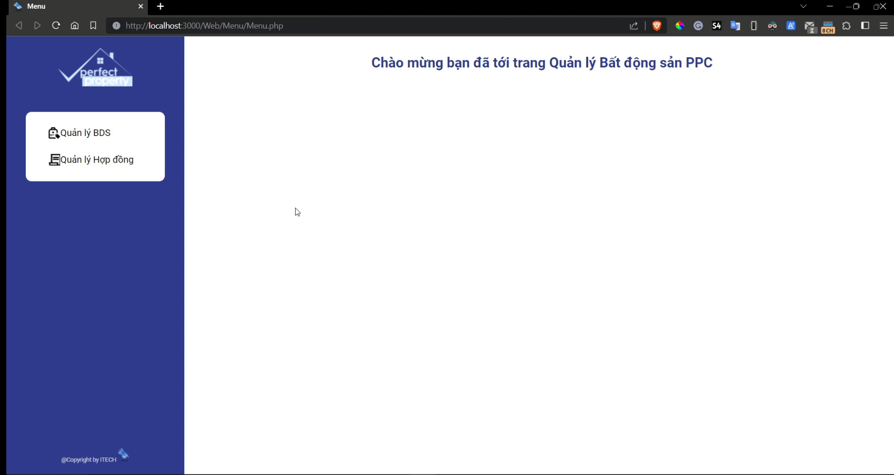
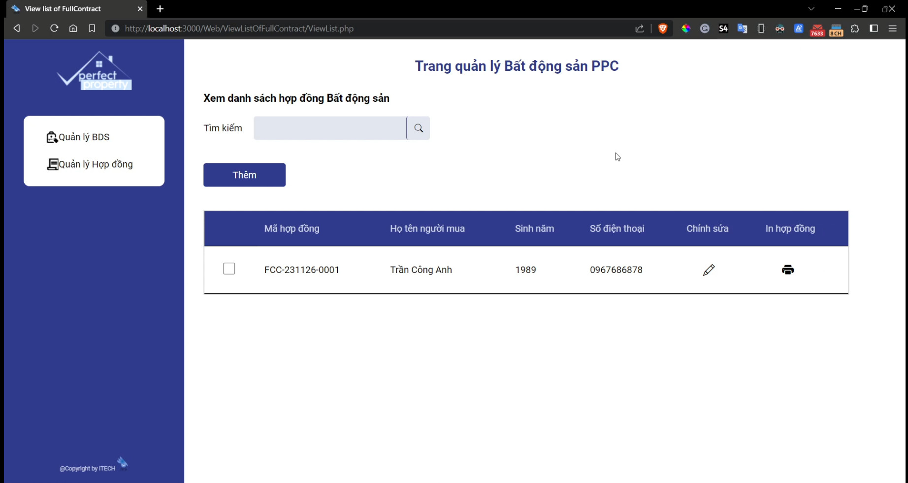
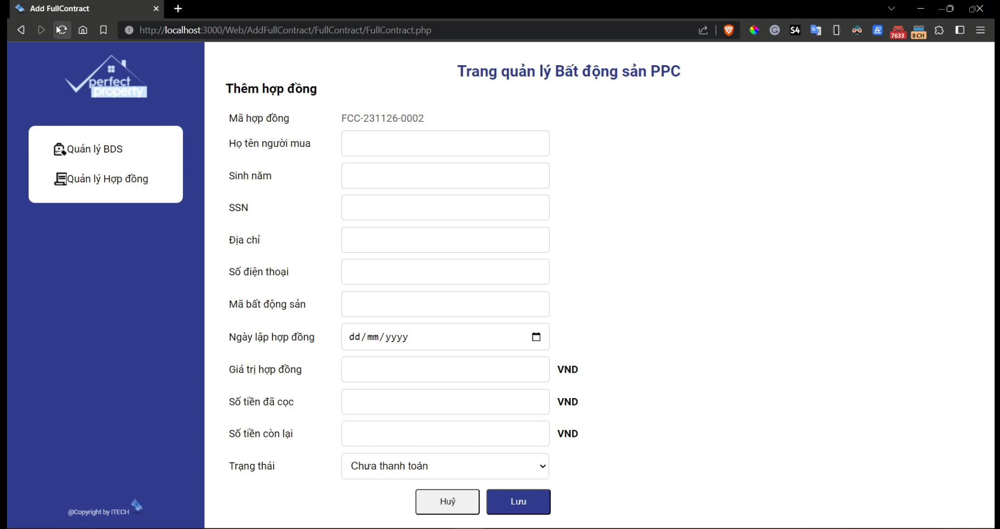

# TEAM04 ITECH - Website Bất Động Sản PPC

---

## Giới thiệu

- Website Bất Động Sản PPC là Website quản lý Bất động sản. Người dùng có thể quản lý cũng như là thêm hợp đồng bất động sản.

## Tính năng

- Xem danh sách Hợp đồng đầy đủ
- Khi người dùng nhấn nút **"Thêm"** thì sẽ chuyển sang trang Quản lý Hợp đồng để người dùng có thể điền nội dung cho Hợp đồng
- Người dùng bấm **"Lưu"** để hệ thống có thể hiển thị hợp đồng người dùng vừa thêm
- Người dùng có thể bấm nút **"Hủy"** nếu muốn hủy hợp đồng.

## Giao diện Website Bất động sản PPC

1. Giao diện khi người dùng bắt đầu truy cập ứng dụng
   

2. Giao diện xem danh sách Hợp đồng đầy đủ
   

3. Giao diện Quản lý hợp đồng nơi người dùng điền thông tin hợp đồng
   

## Lời Cảm Ơn

Cảm ơn cô Lý Thị Huyền Châu và Trường Đại học Văn Lang đã tạo điều kiện để nhóm ITECH chúng em thực hiện bài tập một cách suôn sẻ. Trong quá trình làm còn nhiều thiếu sót nhưng những lời góp ý và sự giúp đỡ của cô, nhóm chúng em đã có thể hoàn thành bài tập một cách trọn vẹn.

**Thành viên TEAM04 ITECH**
|STT|Tên thành viên|MSSV|Nhiệm vụ|
|---|--------------|----|--------|
|1|Tạ Huy Hoàng|207CT27868|Nhóm trưởng|
|2|Hoàng Minh Thuận|207CT28580|Thành viên|
|3|Nguyễn Huỳnh Hiếu|197CT31313|Thành viên|
|4|Lê Minh|207CT65695|Thành viên|
|5|Nguyễn Quốc Khánh Trình| 2174802010883|Thành viên|
